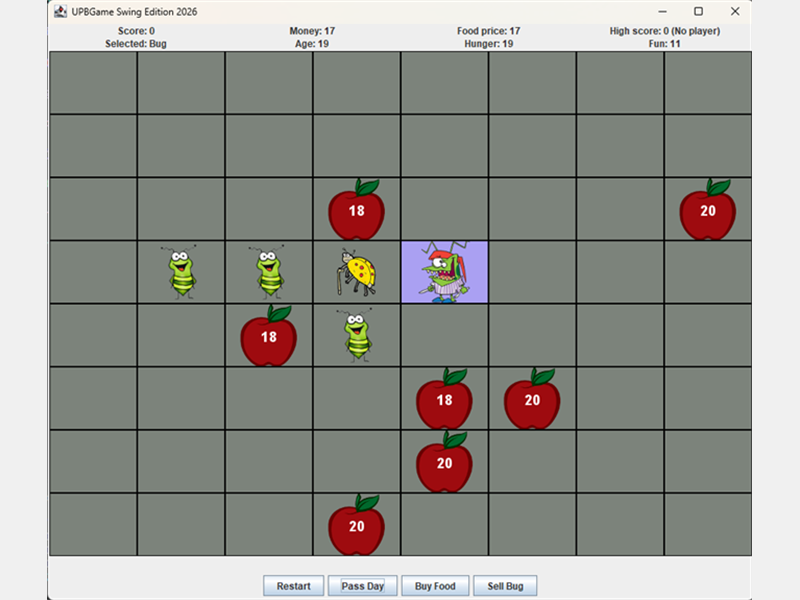
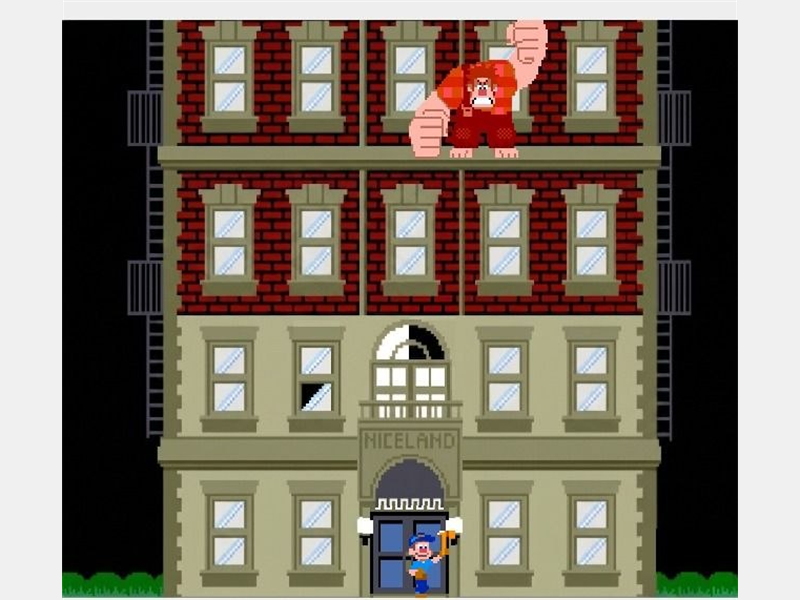
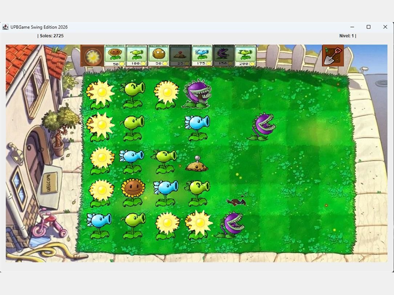

# UPB Game Swing

A lightweight Java Swing framework for building grid-based 2D games, designed for teaching programming at Universidad Privada Boliviana - UPB. Includes **BugWorld**, a complete sample game, inspired by John Conway's game of life.

Students write only the game logic. The framework takes care of the window, the grid, buttons, images, sounds, timers and saved data through a small set of interfaces. Students only need a very basic knowledge of procedural and Object-Oriented programming to learn to use this library, which can be thaught in one hour.

## Made with UPB Game Swing

<table>
  <tr>
    <td align="center" width="33%">
      <br>
      <sub><b>BugWorld</b> example project shipped with the library</sub>
    </td>
    <td align="center" width="33%">
      <br>
      <sub><b>Break It Ralph</b> by Alfredo Loza, Sebastián Quisbert and José Zeballos</sub>
    </td>
    <td align="center" width="33%">
      <br>
      <sub><b>Game name</b> by Alfredo Loza, Elizabeth Pérez and Eyzam Antequera</sub>
    </td>
  </tr>
</table>

## Features

- **Configurable grid**: choose the rows, columns, window size and cell borders. Each cell can show a background image, an object image on top of it, and text.
- **Buttons and labels** that you add, remove and update at runtime.
- **Messages**: dialogs, temporary status messages, and text input.
- **Timers**: run code after a delay or repeat it in a loop that you can stop.
- **Sound**: play `.wav` effects.
- **Storage**: strings, integers and booleans that persist between runs (useful for high scores).
- **Clean separation** between the public API (`core`) and its Swing implementation (`internal`).

## Quick start

You need Java 11 or later.

```bash
bash build.sh             # builds upb-game.jar
java -jar upb-game.jar    # runs the BugWorld sample game
```

`upb-game.jar` includes the compiled classes, the sources and the resources. Besides running BugWorld, you can add it to another project as a library.

## Make your own game

Implement `GameController`. The framework calls your methods when the player interacts with the game:

```java
import edu.upb.lp.game.core.*;

public class MyGame implements GameController {

    private GraphicsLibrary graphics;
    private MessagesLibrary messages;

    @Override
    public void setLibrary(MainLibrary lib) {
        graphics = lib.getGraphics();
        messages = lib.getMessages();
    }

    @Override
    public void initialiseInterface() {
        graphics.configureGrid(5, 5, 600, 600, true);
        graphics.addButton("Start");
        graphics.setLabel("score", "Score: 0");
    }

    @Override
    public void onCellPressed(int row, int col) {
        graphics.setCellObjectImage(row, col, "food");   // loads images/food.png
    }

    @Override
    public void onButtonPressed(String name) {
        messages.showTemporaryMessage(name + " pressed!");
    }
}
```

Then connect it to the Swing implementation:

```java
GameController controller = new MyGame();
MainLibrary lib = new MainSwingLibrary(controller);

controller.setLibrary(lib);
controller.initialiseInterface();
```

Resources are looked up by name on the classpath. Images go in `images/` (`.png`, `.jpg` or `.jpeg`) and sounds in `sounds/` (`.wav`). For example, `"food"` finds `images/food.png` and `playSound("click")` finds `sounds/click.wav`.

## API overview

| Library | Get it with | Methods |
|---|---|---|
| `GraphicsLibrary` | `lib.getGraphics()` | `configureGrid`, `setCellText`, `setCellBackgroundImage`, `setCellObjectImage`, `clearCellObjectImage`, `addButton`, `removeButton`, `setLabel` |
| `MessagesLibrary` | `lib.getMessages()` | `showMessage`, `showTemporaryMessage`, `askText` |
| `TimeLibrary` | `lib.getTime()` | `executeLater`, `executeRepeatedly` (returns a loop id), `stopLoop` |
| `SoundLibrary` | `lib.getSound()` | `playSound`, `stopSounds` |
| `StorageLibrary` | `lib.getStorage()` | `storeString` / `retrieveString`, `storeInt` / `retrieveInt`, `storeBoolean` / `retrieveBoolean` |

## Project structure

```text
src/edu/upb/lp/game/
├── core/        Public API: GameController and the library interfaces
├── internal/    Swing implementation (window, cells, sound, timers, file storage)
├── bugworld/    BugWorld sample game
└── Main.java    Entry point (launches BugWorld)
resources/
├── images/      Game images
└── sounds/      Sound effects
```

## BugWorld

The included sample game: look after a colony of bugs on an 8×8 grid. Buy food, pass the days, sell bugs and clean the cells, all while managing your money and trying to beat the saved high score. Its source in `bugworld/` is a complete example of how to use every library.

## License

[MIT](LICENSE) © 2026 Roberto Cuevas, Alexis Marechal
